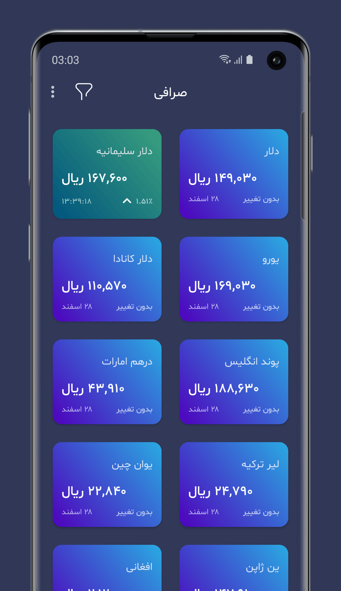
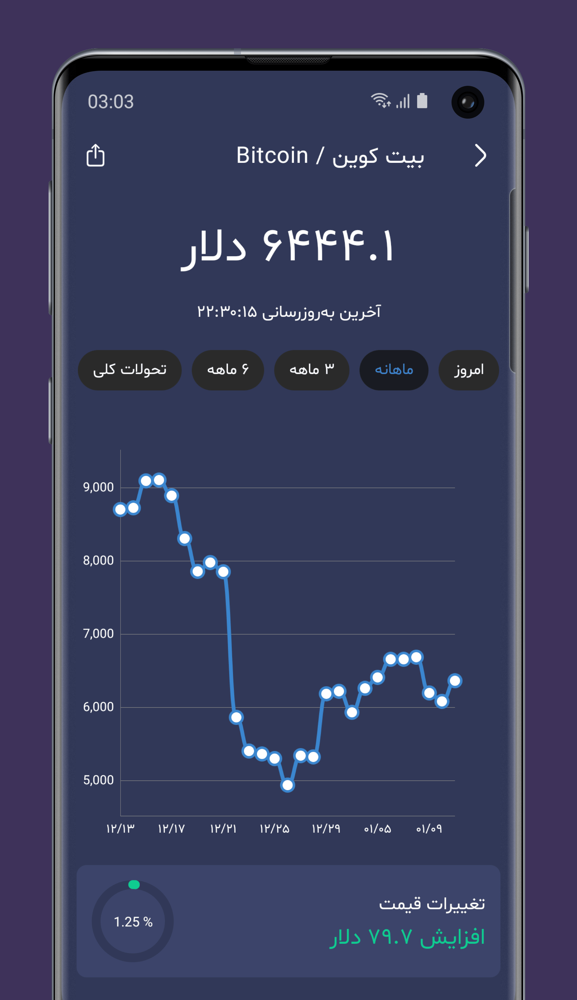
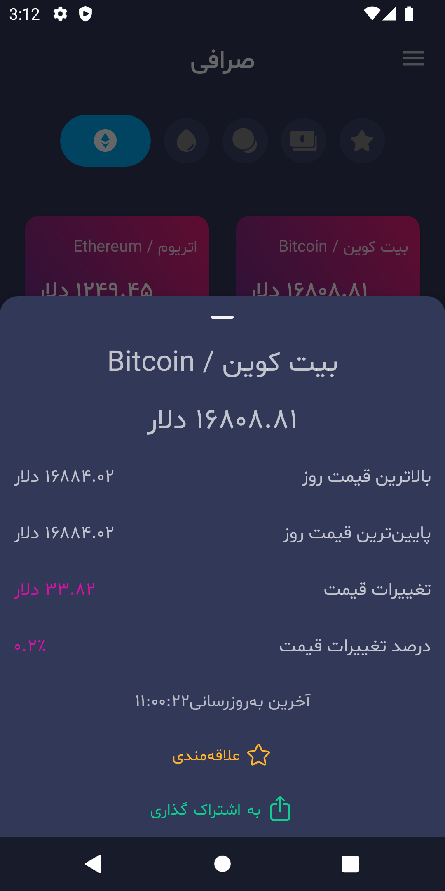
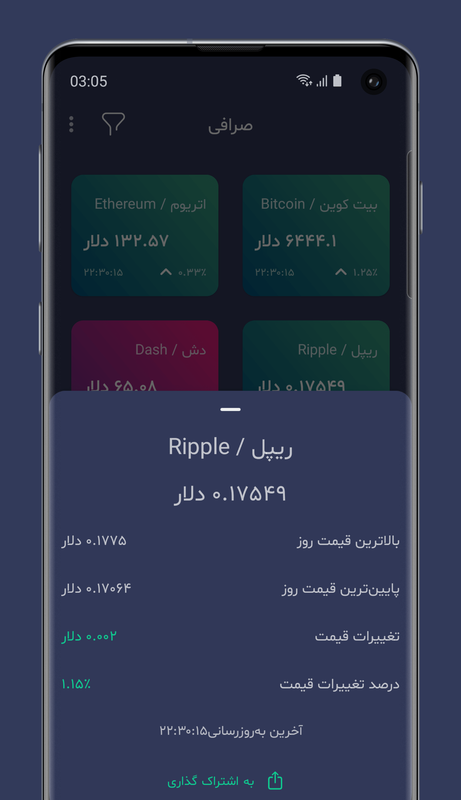

Sarrafi
======

A simple android application that shows latest price of currencies, gold, oil and digital currencies.

This project implemented in [Persian language](https://en.wikipedia.org/wiki/Persian_language) and use [tgju.org](http://www.tgju.org/) website API to get the latest prices.

## Features 🌟

- Display the latest prices
- Price chart and other details
- Quick look preview (Detail bottom sheet)
- Price list in samsung edge panel (only galaxy edge series supported)

## Previews 📱

## How to build 🛠

1- Fork the project & Clone it to your desktop.

2- Open it from Android Studio.

3- Change Package Name.

5- build & run.

## Contribute 🧩

Want to contribute? I would really appreciate a hand with the development to add more features in this app.
Feel free to Fork, edit, then pull!

## Donation ✌🏻

#### Patreon

## Download ⬇️

## Copyright Notice 📝

Copyright (C) 2022 Armin Shalchian

Licensed under the [GNU Version 3](https://www.gnu.org/licenses/gpl-3.0.en.html) license (see the LICENSE file).
